<picture>
  <source media="(prefers-color-scheme: dark)" srcset="docs/logo-dark.png">
  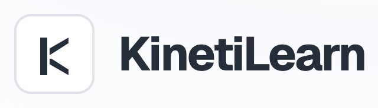
</picture>

An AI-powered LMS with admin portal for training
managers and learner portal for employees: upload training material, generate
exams from it with GPT-6, run a daily quiz engine, and track employees'
skill level from what they actually get right.

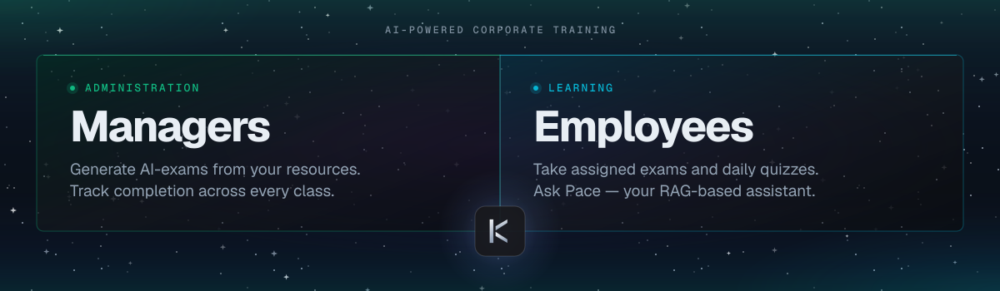

## Why this exists

I built KinetiLearn to practice shipping a full-stack app end to end, not to
launch a product. FastAPI, async SQLAlchemy, a Celery pipeline that processes
uploaded documents, a RAG chatbot, an LLM-driven exam generator, a React admin
UI - all wired together and actually working, not just scaffolded.

## Screenshots / Demo

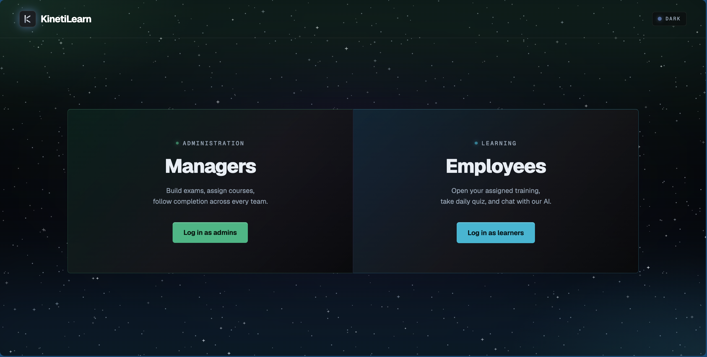

**[Admin-portal walkthrough](docs/demo-videos/admin-portal.mov)**

**[Learner-portal walkthrough](docs/demo-videos/learner-portal.mov)**

<details>
<summary>Screenshots (admin + learner portal)</summary>

### Admin portal

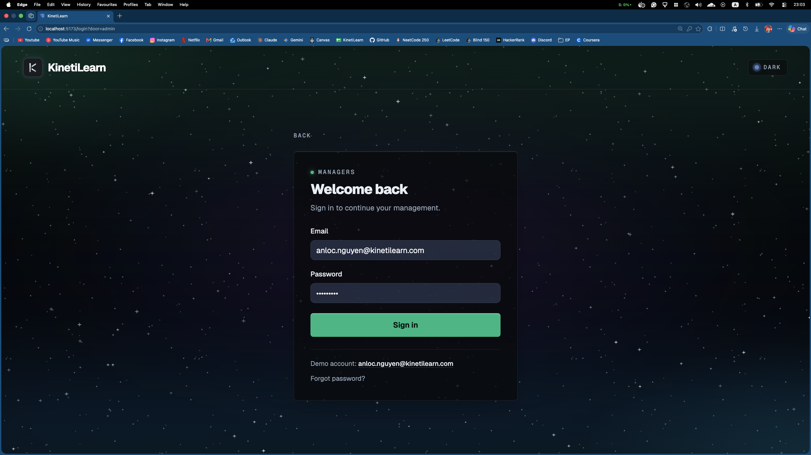

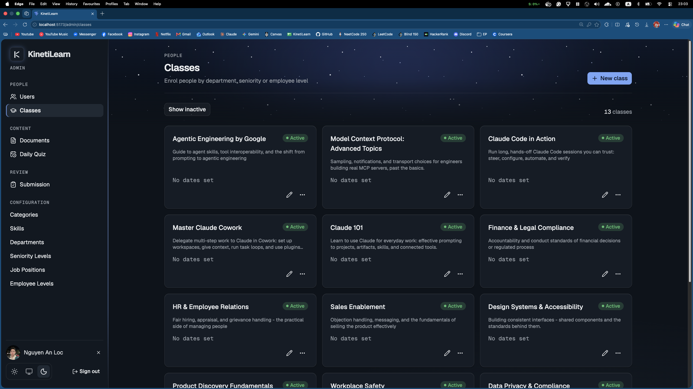

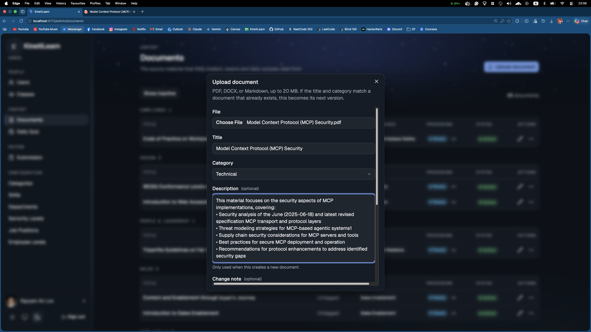
Uploading a PDF and tagging it to the skills it should score

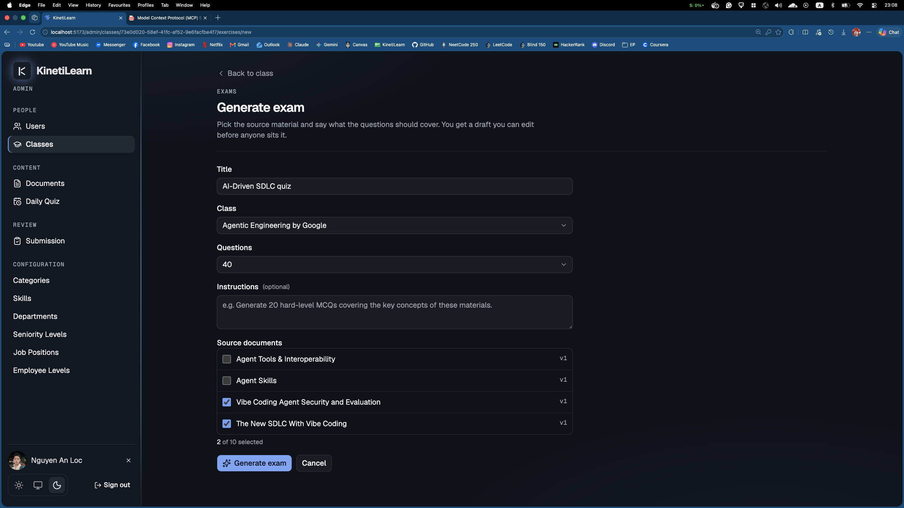
Generating an exam straight from the uploaded material

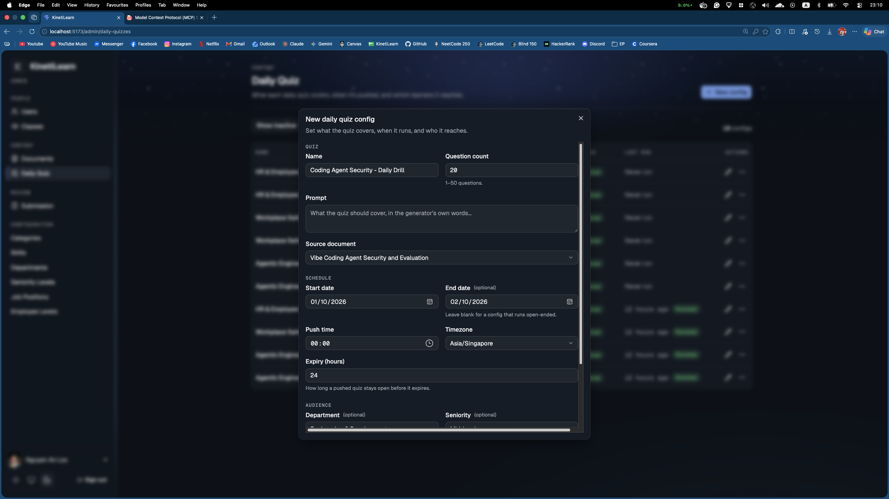
Setting up a daily quiz to push out on a schedule

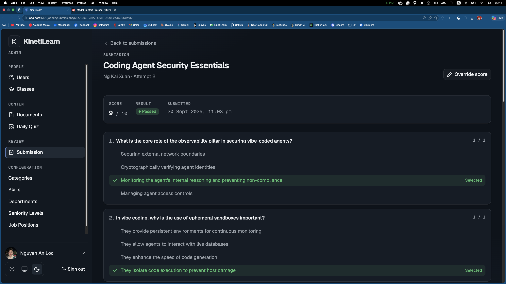
Reviewing how one learner did on a submission

### Learner portal

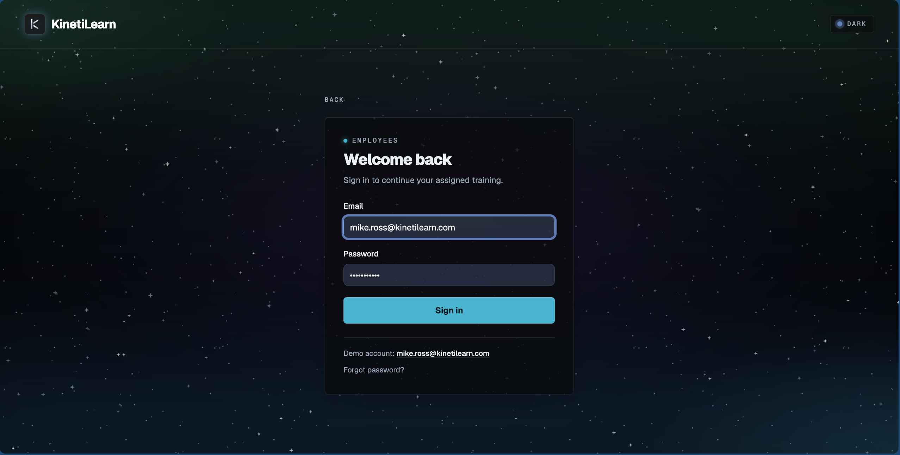

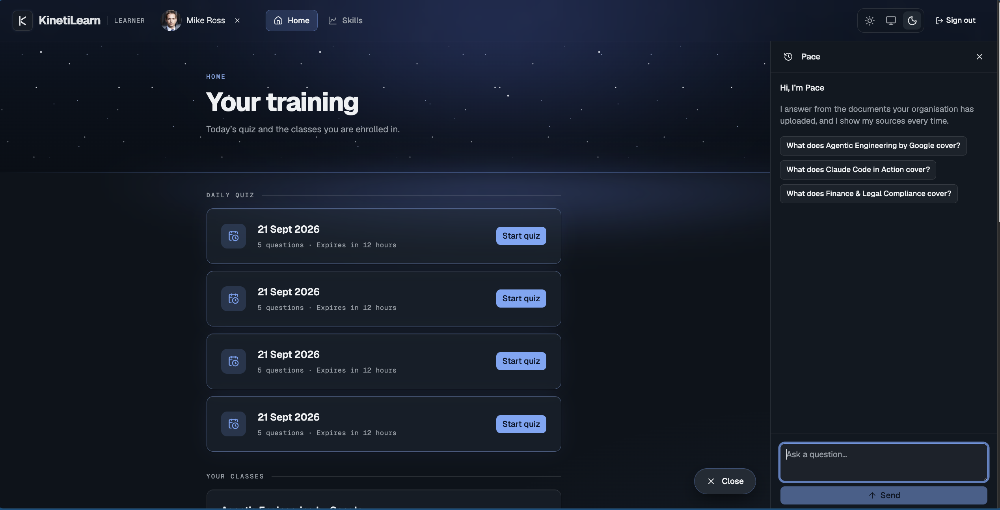

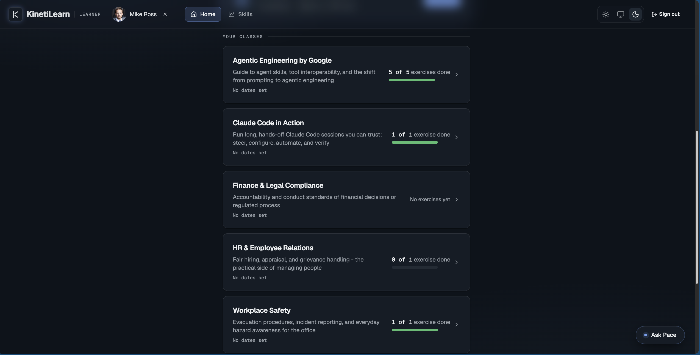

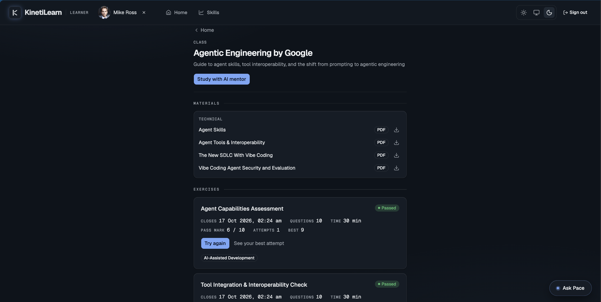

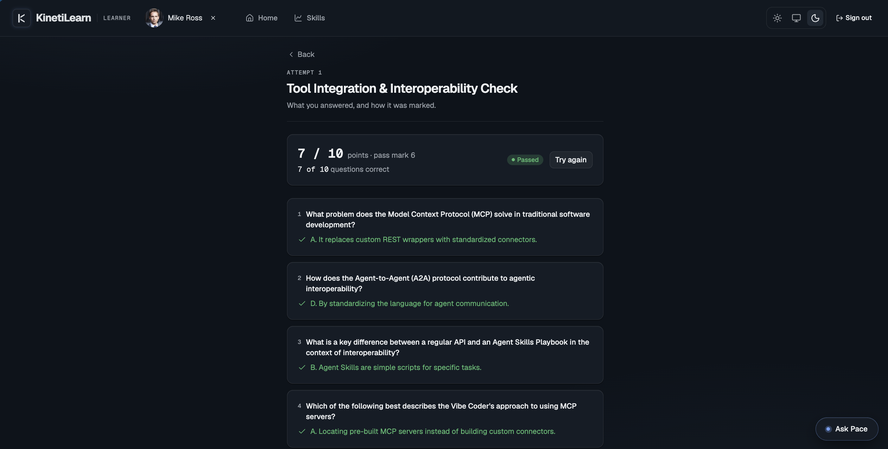

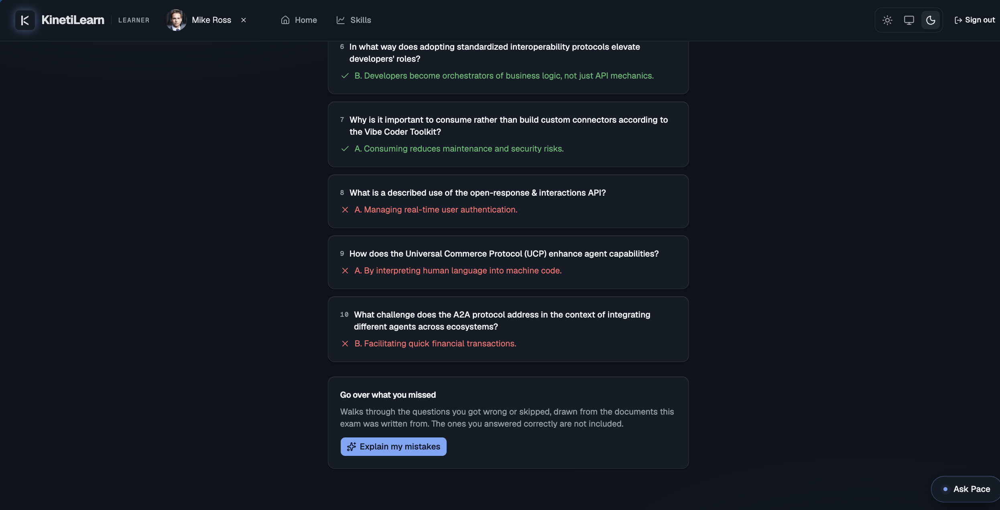
Asking Pace why an answer was marked wrong?

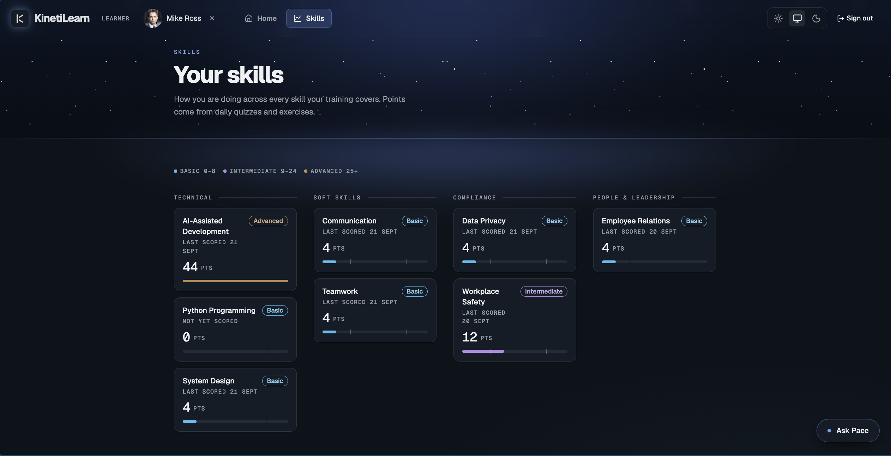

</details>

## Key features

- Upload a document as admin - PDF, DOCX, or Markdown - and it's chunked,
  embedded, and stored in the configured vector store (Pinecone in
  production, Chroma for local/offline dev) through a Celery pipeline.
  Documents are versioned, so a re-upload doesn't overwrite what learners
  already saw.
- Tag a document with skills, then generate a GPT-6 multiple-choice exam
  from it: the admin sets how many questions (1-50) and writes the prompt
  that steers what it asks.
- The chatbot cites the source chunks behind every answer, and says so
  plainly when nothing matches instead of guessing. Its retrieval scope
  narrows to match how the chat was opened: one exam's source documents when
  explaining wrong answers, one class's materials when studying from a class,
  one document, or the whole active corpus.
- Each class has a Materials list and a "Study with AI mentor" chat scoped to
  just that class - retrieval never reaches outside that class's own
  documents into the wider corpus.
- Materials download through a short-lived signed URL (5-minute expiry),
  gated by the same class-membership check as the Materials list itself, not
  a permanent public link.
- Learners take daily quizzes pulled from a configured document and finalized
  exams within their scheduled window, then can ask the chatbot to explain
  exactly what they got wrong and why.
- Correct answers roll up into a per-skill score, checked against
  admin-configured thresholds. The breakdown lists every active skill, even
  ones a learner hasn't touched, so a gap is visible instead of absent.

## Tech stack

Verified from `backend/requirements.txt` and `frontend/package.json`.

**Backend**
- FastAPI + Uvicorn
- SQLAlchemy (async, via `asyncpg`) + Alembic migrations
- PostgreSQL
- Celery + Redis for document processing pipeline
- LangChain + `langchain-openai` + `tiktoken`, calling GPT-6 and
  `text-embedding-3-small` directly through `openai` SDK. One model per task
  rather than one everywhere: `gpt-6-sol` writes exam and daily-quiz questions,
  `gpt-6-luna` answers RAG chat and suggests skills (see
  [DECISIONS.md](docs/DECISIONS.md))
- Vector DB selected by the `VECTOR_STORE_BACKEND` env var: `chroma`
  (local/offline-dev fallback) or `pinecone`
  (**the current production backend** - index `kinetilearn`, dimension
  1536, metric cosine, same `text-embedding-3-small` embeddings as before,
  this was a backend swap, not a model change).
- PyMuPDF and `python-docx` for document text extraction
- boto3 for Cloudflare R2 (S3-compatible) file storage
- passlib (bcrypt) + `python-jose` for password hashing and JWTs
- pytest + pytest-asyncio + httpx for the test suite (499 tests, all passing)

**Frontend**
- React 19 + TypeScript, built with Vite
- React Router 7, TanStack Query 5
- Tailwind CSS 4 + Radix UI primitives + shadcn
- Recharts for the skill breakdown charts
- Vitest + Testing Library + MSW for unit tests (460 tests, all passing),
  Playwright for e2e
- `openapi-typescript` generates the API types from the running backend's
  OpenAPI schema (`npm run gen:api`)

## Setup

### 1. Start Postgres and Redis

```bash
docker compose up -d postgres redis
```

### 2. Backend

```bash
cd backend
python -m venv .venv && source .venv/bin/activate
pip install -r requirements.txt
cp .env.example .env
```

Edit `.env` and fill in:
- `OPENAI_API_KEY` - required, the app won't start without it
- `JWT_SECRET` - anything, for local dev
- `R2_ACCESS_KEY` / `R2_SECRET_KEY` / `R2_BUCKET_NAME` / `R2_ENDPOINT_URL` -
  only needed if you test document upload against real R2
- `VECTOR_STORE_BACKEND` - `chroma` (default) or `pinecone` (the production backend; needs
  `PINECONE_API_KEY` + `PINECONE_INDEX` filled in, and a Pinecone index
  already created at dimension 1536 / metric cosine before you switch)

```bash
alembic upgrade head
uvicorn app.main:app --reload
```

In terminal 2, start the Celery worker (required for document processing and
exam generation, both run as workerr tasks):

```bash
celery -A worker.tasks:celery_app worker --loglevel=info
```

Run the backend tests:

```bash
pytest
```

### 3. Frontend

```bash
cd frontend
npm install
npm run dev
```

`frontend/.env.development` already points `VITE_API_BASE_URL` at
`http://localhost:8000`, so no changes needed for local dev.

Run the frontend tests:

```bash
npm run test        # vitest
npm run test:e2e    # playwright, needs the backend running
```

### 4. Seed data (optional)

Seed scripts live in `backend/scripts/` and must run in this order:

```bash
python -m scripts.seed_config
python -m scripts.seed_users
python -m scripts.seed_classes
python -m scripts.seed_content   # costs OpenAI credits
```

## docs/

More decisions during developing KinetiLearn, find in
[docs/DECISIONS.md](docs/DECISIONS.md).\
For the directory layout and how the modules relate to each other, see
[docs/ARCHITECTURE.md](docs/ARCHITECTURE.md).
